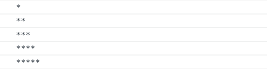
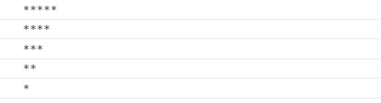
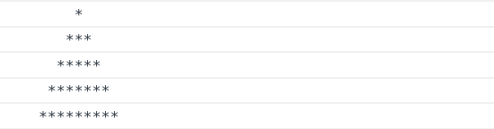
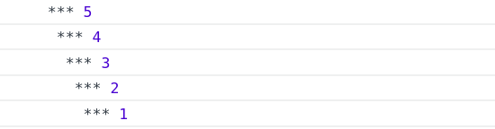
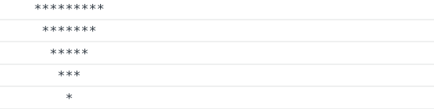
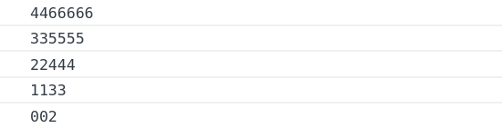
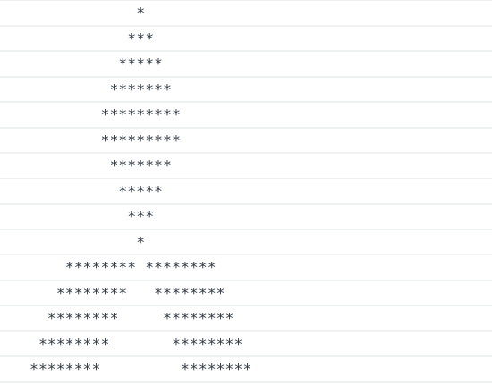

# Javascript Looping

---

## Requirements

Use javascript looping `for`, `while`, or `do while` to create a specific pattern.   

---

## Level 0

## Level 1

## Level 2

## Level 3

## Level 4

## Level 5

## Level 6

